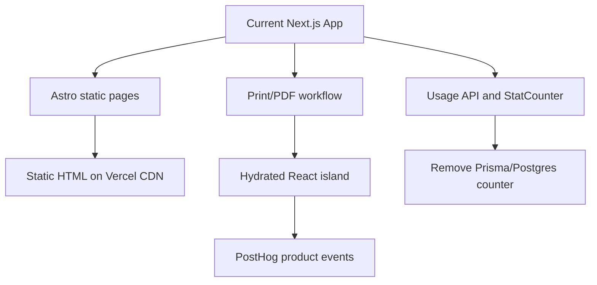

# Plan: Move PostLabel To Static Astro

## Current Findings

- The app is small and mostly static: public pages under `[src/app/(site)](src/app/(site))`, shared nav/layout, and a single interactive print route.
- The core product logic is already client-side in `[src/app/utils/pdf-util.ts](src/app/utils/pdf-util.ts)`, using `pdfjs-dist`, canvas, `jspdf`, and `file-saver`.
- The only server route is `[src/app/api/usage/route.ts](src/app/api/usage/route.ts)`, and it exists to back the public `StatCounter`.
- Vercel project metadata confirms the deployment is a `nextjs` framework project on Node `22.x`, with `postlabel.neveroff.dev` attached.
- Current Next-specific dependencies are easy to identify: `next/link`, `next/image`, `next/font`, App Router metadata/layouts, `next-sitemap`, `next lint`, and `NextRequest`/`NextResponse`.
- Current package manager is npm via `package-lock.json`; migration should replace this with `pnpm-lock.yaml` and update scripts.
- Vercel supports Astro static output directly; if the custom database counter is removed, there is no need for Astro hybrid/server output.

## Captured Browser Baselines

- Local `http://localhost:3000/`: homepage layout matches expected nav/hero/how-it-works content and shows the stat chip with `23 files`, `47 pages`, and `9 labels`.
- Production `https://postlabel.neveroff.dev/`: homepage layout matches local and shows the stat chip with `549 files`, `949 pages`, and `1,041 labels`.
- The stat chip is useful social proof, but it is the only thing keeping the custom Postgres/Prisma API path alive.

## Recommended Architecture

Use Astro as the static application shell. Keep React only for the interactive `/print` PDF workflow. Replace the custom stats database with privacy-preserving PostHog browser events, and remove the public stat chip for now.

This makes the app simpler than the current Next.js version: no API route, no Prisma, no Postgres secret, no server runtime, and no TanStack dependency.



## Chosen Direction

Build home/about/legal pages as `.astro` pages, create a shared Astro layout/nav/footer, and mount the print tool as a React component with `client:load` on `/print`. Instrument the print workflow with explicit PostHog events instead of maintaining a public counter.

Why it fits:

- Best alignment with the repo’s mostly static content.
- Minimal JavaScript on informational pages.
- Smallest conceptual migration from the existing browser-only PDF workflow.
- Astro has first-class React integration and Vercel support.
- Sitemap/robots can move from `next-sitemap` to `@astrojs/sitemap` or static files.
- PostHog gives aggregate product analytics without storing uploaded PDFs, label text, addresses, filenames, or tracking numbers.
- Dropping the counter removes the need for `POSTGRES_PRISMA_URL` entirely.

Tradeoffs:

- The print route still ships a substantial React/PDF bundle, which is appropriate for that page.
- The public stat chip goes away unless we later add a hosted aggregate stats API.
- PostHog receives browser analytics transport metadata, so the privacy posture should say aggregate analytics rather than “no telemetry”.

## Recommendation

Proceed with static Astro + React print island + pnpm + PostHog client analytics. Leave TanStack out of the initial implementation.

## Target Structure

```text
src/
  components/
    nav/
    print/
    analytics/
  layouts/
    BaseLayout.astro
  pages/
    index.astro
    about.astro
    print.astro
    legal/
      data.astro
      privacy.astro
      terms.astro
      tldr.astro
  models/
  utils/
  styles/
```

## Implementation Plan

1. Baseline and package manager migration:
   - Keep the captured local and production homepage snapshots as the visual/accessibility baseline.
   - Enable pnpm with `packageManager` in `[package.json](package.json)`.
   - Remove `package-lock.json`, generate `pnpm-lock.yaml`, and update install/build docs in `[README.md](README.md)`.
   - Update scripts from `next dev/build/start/lint` to `astro dev`, `astro build`, `astro preview`, plus typecheck/lint equivalents.

2. Create the Astro shell:
   - Add `astro`, `@astrojs/react`, `@astrojs/tailwind`, `@astrojs/sitemap`, and `@astrojs/vercel`.
   - Configure `[astro.config.mjs](astro.config.mjs)` for static Astro output with the Astro Vercel static adapter.
   - Replace `[src/app/layout.tsx](src/app/layout.tsx)` with `[src/layouts/BaseLayout.astro](src/layouts/BaseLayout.astro)`.
   - Port `[src/app/components/nav/TopNav.tsx](src/app/components/nav/TopNav.tsx)` and `[src/app/components/nav/Footer.tsx](src/app/components/nav/Footer.tsx)` to Astro or keep them as React components if faster.
   - Move static pages from `[src/app/(site)](src/app/(site))` to `[src/pages](src/pages)` as `.astro` pages.
   - Replace `next/link` with plain `<a>` in Astro pages and normal anchors in React components.

3. Port assets, styles, and metadata:
   - Move `[src/app/globals.css](src/app/globals.css)` to a framework-neutral path such as `[src/styles/globals.css](src/styles/globals.css)`.
   - Update `[tailwind.config.ts](tailwind.config.ts)` content globs for the new route/component paths.
   - Replace `next/image` with Astro `<Image />` where useful or plain `` for simple public assets.
   - Replace `next/font` with a self-hosted/static font approach or a simple CSS font stack.
   - Replace `next-sitemap` with `@astrojs/sitemap` and static `robots.txt` if needed.
   - Move page metadata into Astro frontmatter/layout props.

4. Preserve the print workflow:
   - Create `[src/pages/print.astro](src/pages/print.astro)` and mount a React component such as `[src/components/print/PrintTool.tsx](src/components/print/PrintTool.tsx)` with `client:load`.
   - Move `[src/app/utils/pdf-util.ts](src/app/utils/pdf-util.ts)` and model files to framework-neutral locations under `[src/utils](src/utils)` and `[src/models](src/models)`.
   - Replace `next/image` and `next/link` imports inside the print page.
   - Verify `pdfjs-dist` worker configuration under Astro/Vite.
   - Keep processing entirely in-browser.
   - Do not add TanStack for this migration unless a concrete multi-step client routing need appears.

5. Add PostHog analytics:
   - Add a `[src/components/analytics/PostHog.astro](src/components/analytics/PostHog.astro)` component based on the manual Astro snippet.
   - Include it from `[src/layouts/BaseLayout.astro](src/layouts/BaseLayout.astro)` so pageviews are captured consistently.
   - Treat PostHog’s project key as publishable browser configuration, not a private management token. If using env injection, prefer a `PUBLIC_POSTHOG_KEY`/`PUBLIC_POSTHOG_HOST` style variable for Astro client exposure rather than leaking any private API key.
   - Configure PostHog for privacy: no `identify`, no PDF/file contents, no filenames, no label text, no addresses, no tracking numbers, and no stable browser fingerprint IDs.
   - Consider disabling autocapture/session replay unless explicitly wanted; use explicit product events for the print workflow.

6. Replace custom usage tracking with wide product events:
   - Remove `StatCounter` from the homepage and adjust copy so the page no longer claims live custom public stats.
   - Remove calls to `/api/usage` from `[src/app/utils/pdf-util.ts](src/app/utils/pdf-util.ts)` during the port.
   - Capture explicit events such as `label_processing_completed`, `label_pdf_downloaded`, `label_pdf_printed`, and `label_processing_failed`.
   - Use wide-event-style properties: `files_count`, `pages_count`, `labels_count`, `payload_size_bytes`, label type counts, `duration_ms`, `outcome`, and non-identifying environment/page context.
   - Avoid unstructured console logs for analytics paths; if client errors are logged, keep them structured and scrubbed.

7. Remove the custom backend/database surface:
   - Delete the Next usage route replacement from the migration scope; no `[src/pages/api/usage.ts](src/pages/api/usage.ts)` is needed.
   - Remove Prisma schema/client/seed usage if no other code path needs it.
   - Remove `POSTGRES_PRISMA_URL` from required env docs and Vercel project settings after the migrated site is verified.
   - Remove `@prisma/client`, `prisma`, `@vercel/postgres`, `ts-node`, and `tsconfig-paths` if they become unused.

8. Update Vercel deployment:
   - Change Vercel framework from `nextjs` to Astro.
   - Use static Astro build output with the Astro Vercel adapter.
   - Preserve current custom domain `postlabel.neveroff.dev`.
   - Remove the current sitemap/robots rewrites in `[vercel.json](vercel.json)` if Astro generates those files directly.
   - Keep only PostHog public analytics configuration in Vercel env vars if needed.

9. Clean dependency surface:
   - Remove `next`, `eslint-config-next`, `next-sitemap`, Prisma/Postgres packages, and unused Vercel Analytics if PostHog replaces it.
   - Keep `react` and `react-dom` for islands.
   - Keep `pdfjs-dist`, `jspdf`, `file-saver`, and the PDF-related dependencies still needed by the print island.

10. Verification:
   - Run `pnpm install`, `pnpm lint` or equivalent, `pnpm typecheck`, and `pnpm build`.
   - Verify direct URL loads for `/`, `/print`, `/about`, and legal pages.
   - Verify marketing/legal pages render without unnecessary client JavaScript.
   - Verify upload/process/download/print flow using sample PDFs.
   - Verify PostHog receives expected aggregate events from local/preview without sensitive payload fields.
   - Verify sitemap and robots output.
   - Compare local and production homepage snapshots against the captured baseline, accepting the intentional stat chip removal.

## Suggested First Milestone

Build the Astro static shell first with the existing static pages and shared layout, then mount the print tool as a React island. After the UI matches the captured baseline minus the intentional stat chip removal, add PostHog explicit product events and remove the Prisma/Postgres usage-counter path.